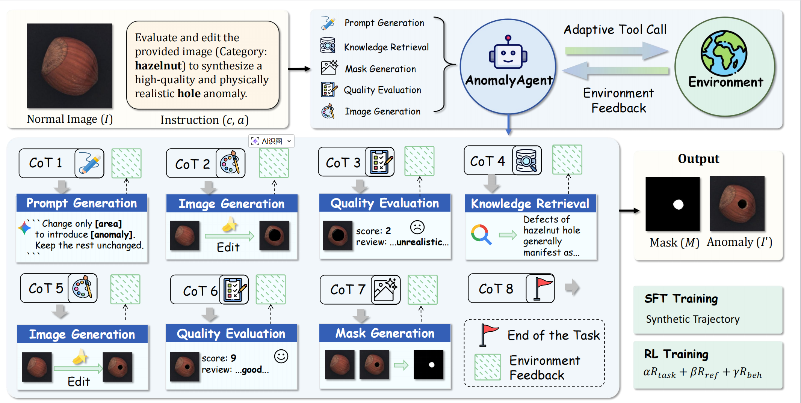
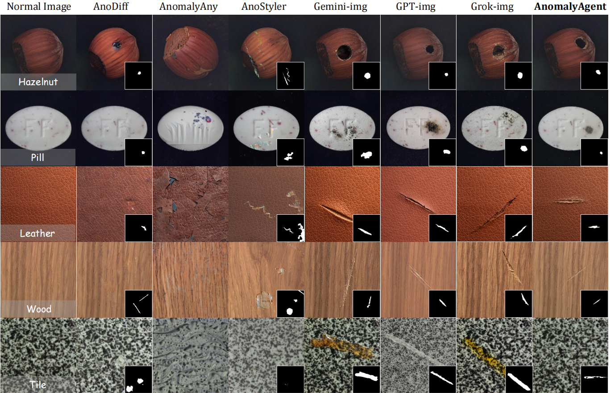

# AnomalyAgent

Official research code for **AnomalyAgent: Agentic Industrial Anomaly Synthesis via Tool-Augmented Reinforcement Learning** 

# News
[2026.07.09] 🎉🎉🎉 Our work has been accepted by ACM Multimedia 2026 (ACMMM 2026)! We are grateful to the committee and look forward to sharing our research at the conference.

# Introduction
AnomalyAgent turns industrial anomaly synthesis into a multi-turn tool-use process. A Qwen3-VL agent plans and refines local edits using five tools: Prompt Generation (PG), Image Generation (IG), Quality Evaluation (QE), Knowledge Retrieval (KR), and Mask Generation (MG).

# Visualization

