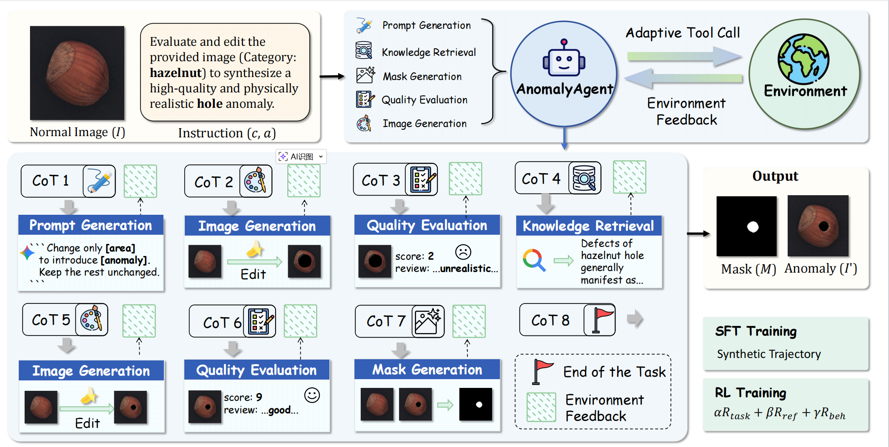
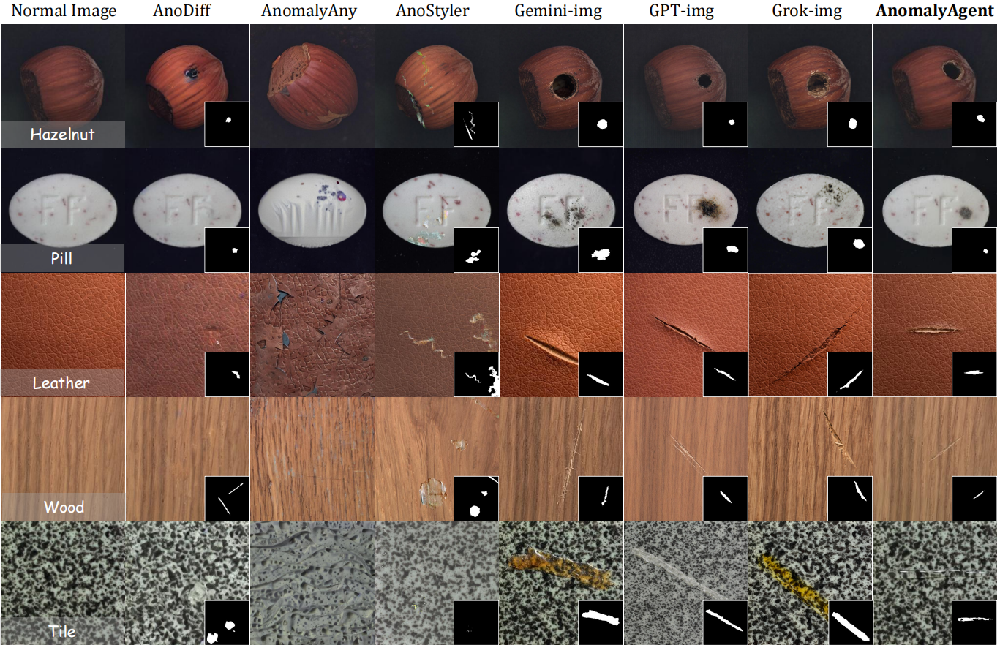
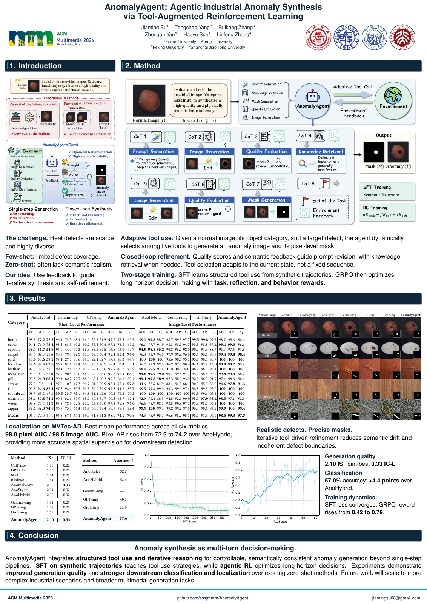

# AnomalyAgent

[](https://arxiv.org/abs/2604.07900)
[](https://cloud.tencent.com/developer/article/2655939)

Official research code for **AnomalyAgent: Agentic Industrial Anomaly Synthesis via Tool-Augmented Reinforcement Learning** 

# News
[2026.07.09] 🎉🎉🎉 Our work has been accepted by ACM Multimedia 2026 (ACMMM 2026)! We are grateful to the committee and look forward to sharing our research at the conference.

# Introduction
AnomalyAgent turns industrial anomaly synthesis into a multi-turn tool-use process. A Qwen3-VL agent plans and refines local edits using five tools: Prompt Generation (PG), Image Generation (IG), Quality Evaluation (QE), Knowledge Retrieval (KR), and Mask Generation (MG).



# Visualization


# Poster

Our ACM Multimedia 2026 poster. Click the preview to open the full-resolution PDF.

<p align="center">
  <a href="./MM/poster.pdf">
    
  </a>
</p>

[View / download PDF](./MM/poster.pdf) · [LaTeX poster template](./MM/poster.tex)

## Use the poster template

Start with [MM/poster.tex](./MM/poster.tex) to adapt the A0 portrait layout, title, authors, and section text. Keep the accompanying styles, figures, table sources, and `vendor/` fonts in [MM/](./MM/). Replace the paper content and logos with your own before sharing.

With a LaTeX installation providing `pdflatex`, Beamer, and the required packages, plus `pdfinfo` (Poppler), build from the repository root:

```bash
cd MM
bash render_poster.sh --once
```

The output is `MM/poster.pdf`. Run `bash render_poster.sh` without `--once` to rebuild automatically when source files change. The README preview is a separate PNG; refresh it after updating the PDF:

```bash
pdftoppm -scale-to 1600 -png -singlefile poster.pdf build/poster-preview
```
